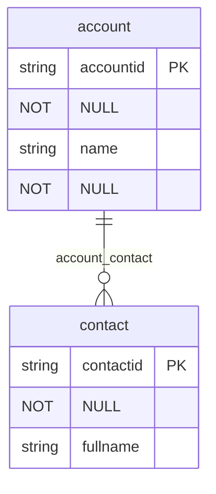

# Implementation Summary

## What Was Implemented

This implementation successfully sets up the DVDT-Tools repository as a **monorepo** for Dataverse DevTools, starting with an **ERD (Entity Relationship Diagram) Generator** tool.

## Repository Structure Created

```
DVDT-Tools/
├── packages/
│   └── erd-generator/              # First tool in the monorepo
│       ├── src/
│       │   ├── ERDGenerator.ts     # Main generator class
│       │   ├── types.ts            # TypeScript type definitions
│       │   └── index.ts            # Public API exports
│       ├── example.ts              # Usage examples
│       ├── example-save.ts         # Save to file examples
│       ├── package.json            # Package configuration
│       ├── tsconfig.json           # TypeScript config
│       └── README.md               # Package documentation
├── .editorconfig                   # Editor configuration
├── .gitattributes                  # Git attributes
├── .gitignore                      # Git ignore rules
├── .npmrc                          # NPM configuration
├── CHANGELOG.md                    # Version changelog
├── CONTRIBUTING.md                 # Contribution guidelines
├── LICENSE                         # GPL-2.0 license
├── README.md                       # Main documentation
├── package.json                    # Root workspace config
└── tsconfig.json                   # Shared TypeScript config
```

## Key Features Implemented

### 1. Monorepo Setup
- ✅ NPM workspaces configuration
- ✅ Shared TypeScript configuration
- ✅ Centralized build system
- ✅ Scalable structure for future tools

### 2. ERD Generator (@dvdt-tools/erd-generator)
- ✅ Generate ERD from Dataverse solution metadata
- ✅ Support for **3 diagram formats**:
  - **Mermaid** - GitHub/VS Code compatible
  - **PlantUML** - Detailed UML diagrams
  - **Graphviz DOT** - Flexible graph visualization
- ✅ Configurable options:
  - Include/exclude attributes
  - Include/exclude relationships
  - Limit attributes per table
- ✅ Complete TypeScript type definitions
- ✅ Working examples included

### 3. Documentation
- ✅ Comprehensive README files
- ✅ Contributing guidelines
- ✅ Changelog for tracking versions
- ✅ Package-specific documentation

### 4. Development Tools
- ✅ TypeScript compilation
- ✅ Build scripts for all packages
- ✅ Development watch mode
- ✅ Editor configuration (.editorconfig)

## Example Usage

### Basic Usage

```typescript
import { ERDGenerator, DataverseSolution } from '@dvdt-tools/erd-generator';

const solution: DataverseSolution = {
  uniqueName: 'MySolution',
  displayName: 'My Solution',
  version: '1.0.0',
  publisherPrefix: 'myprefix',
  tables: [/* table definitions */]
};

const generator = new ERDGenerator({
  format: 'mermaid',
  includeAttributes: true,
  includeRelationships: true
});

const erd = generator.generate(solution);
console.log(erd);
```

### Example Output (Mermaid)



## How to Build and Use

### Install Dependencies
```bash
npm install
```

### Build All Packages
```bash
npm run build
```

### Run Examples
```bash
cd packages/erd-generator
npx ts-node example.ts
```

### Development Mode
```bash
cd packages/erd-generator
npm run dev
```

## Integration with VS Code Extension

This monorepo structure makes it easy to:

1. **Import the ERD generator** in a VS Code extension:
   ```typescript
   import { ERDGenerator } from '@dvdt-tools/erd-generator';
   ```

2. **Get user input** for a Dataverse solution
3. **Fetch solution metadata** via Dataverse API
4. **Generate ERD** using the ERDGenerator class
5. **Display or save** the diagram in VS Code

## Future Extensibility

The monorepo structure supports adding new tools easily:

```
packages/
├── erd-generator/          # ✅ Implemented
├── schema-validator/       # Future: Validate solution schemas
├── metadata-extractor/     # Future: Extract metadata from solutions
├── deployment-helper/      # Future: Assist with deployments
└── [other-tools]/         # Add more as needed
```

## Testing

All functionality has been tested and verified:
- ✅ TypeScript compilation successful
- ✅ All three diagram formats generate correctly
- ✅ Examples run without errors
- ✅ File saving functionality works
- ✅ Package structure follows best practices

## Conclusion

The DVDT-Tools repository is now a fully functional monorepo with:
- Professional project structure
- Working ERD generator tool
- Comprehensive documentation
- Easy extensibility for future tools
- Ready for integration with VS Code extensions
